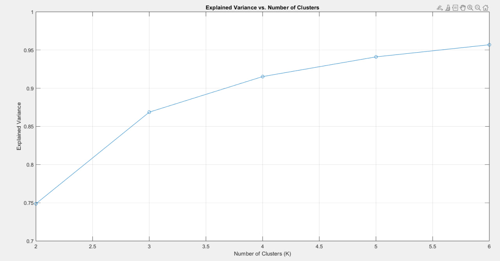
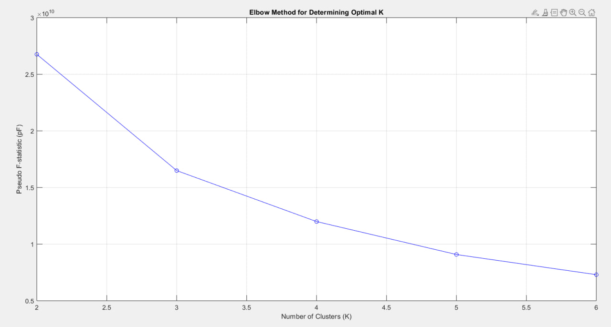

# World Bank SPI - Clustering and Dimensionality Reduction in MATLAB

[](https://www.mathworks.com/products/matlab.html)
[](https://www.mathworks.com/products/statistics.html)
[](LICENSE)
[](https://datacatalog.worldbank.org/search/dataset/0037996)

MATLAB implementations of four **joint clustering + dimensionality-reduction** algorithms - Reduced K-means, Factorial K-means, Clustering & Disjoint PCA, and Double K-means - written at the matrix-algebra level rather than assembled from toolbox calls, and applied to the World Bank's **Statistical Performance Indicators (SPI)** dataset.

The interesting part of this repository is not that data got clustered. It is that each of these methods solves a *different* optimisation problem over the same data, and having all four side by side makes the differences visible: run them on the same matrix and they do not agree - which is exactly the point.

---

## Why these four methods

Ordinary K-means clusters objects. PCA reduces variables. Doing them in sequence - PCA first, then K-means on the scores - is the standard shortcut, and it is not guaranteed to work: the directions with the most variance are not necessarily the directions that separate clusters. The four algorithms here refuse the shortcut and estimate the partition **and** the subspace simultaneously, each with a different definition of what "simultaneously" means.

| Method | Model | What it maximises | File |
|---|---|---|---|
| **K-means** (multi-start) | `X ≈ U·X̄` | between-cluster deviance in the full space | [`kmeansN.m`](scripts/kmeansN.m) |
| **Reduced K-means** (RKM) | `X ≈ U·Ȳ·A'` | between-cluster deviance measured **after projecting back** into the original space | [`REDKM.m`](scripts/REDKM.m) |
| **Factorial K-means** (FKM) | `X·A ≈ U·Ȳ` | between-cluster deviance measured **inside the reduced space** | [`FKM.m`](scripts/FKM.m) |
| **Clustering & Disjoint PCA** (CDPCA) | `X ≈ U·Ȳ·V'B` | same, but each variable loads on **exactly one** component (`V` binary) | [`CDPCA.m`](scripts/CDPCA.m) |
| **Double K-means** (DKM) | `X ≈ U·Ȳ·V'` | a partition of objects **and** a partition of variables at once | [`DKM.m`](scripts/DKM.m) |

The RKM/FKM contrast is the clearest one. RKM keeps components that carry a lot of the original variance *and* discriminate between clusters, so it can be dragged around by a dominant but uninformative direction. FKM only cares about separation inside the subspace it chooses, so it will happily throw away a high-variance direction that does not help tell the groups apart. Two defensible answers to the same question - and on this data they land in very different places (see [Results](#results)).

`U` is the object membership matrix (binary, row-stochastic), `V` the variable membership matrix, `A` the loadings, `Ȳ` the centroids in the reduced space.

### Implementation details that matter

All four are alternating least-squares loops, and they share the engineering that makes ALS behave:

- **Multi-start.** Every algorithm takes a `Rndstart` argument and keeps the best of *N* random initialisations. ALS converges to a local optimum; one run tells you very little. The analysis uses 30-100 starts.
- **Empty-cluster repair.** If an update empties a cluster, the largest cluster is split in half to refill it, in a `while` loop until every cluster is non-empty - instead of crashing or silently returning a degenerate `K`.
- **Convergence on the objective, not on the labels.** Iteration stops when the objective improves by less than `1e-10`, capped at 100 iterations.
- **Deterministic output ordering.** Components are re-sorted by descending variance and cluster columns by descending cardinality before returning, so runs are comparable to each other. FKM additionally applies a varimax rotation to the loadings.
- **Eigen-step chosen per method.** Full `eig` with an explicit descending sort where all components are needed, `eigs(·,1,'lm')` inside CDPCA's variable-reassignment loop where only the leading eigenvector of a submatrix is needed - the latter runs `J × Q` times per iteration, so it matters.

Model selection is handled separately by [`psF.m`](scripts/psF.m) (Calinski-Harabasz pseudo-*F*), [`elbow_method.m`](scripts/elbow_method.m) and [`compute_explained_variance.m`](scripts/compute_explained_variance.m).

---

## The data

The [World Bank Statistical Performance Indicators](https://www.worldbank.org/en/programs/statistical-performance-indicators) score how well each country's national statistical system performs - how it uses data, what services it offers, what products it publishes, what sources it draws on, and what infrastructure supports it.

[`data/SPI_data1.xlsx`](data/SPI_data1.xlsx) has three sheets:

| Sheet | Shape | Contents |
|---|---|---|
| `Long` | 298,080 × 7 | one row per country × indicator × year - `country`, `iso3c`, `date`, `source_name`, `source_id`, `value`, `footnote` |
| `Wide` | 4,140 × 79 | one row per country-year, 76 indicator columns plus `income`, `region`, `population` |
| `Series` | 119 × 20 | indicator metadata - definitions, periodicity, source, licence |

222 country entries, 72 indicator series, **2004-2022**. Scores run on two scales: the five pillar scores and the overall SPI index are 0-100, the underlying dimension and raw indicators are 0-1.

The pipeline reads the **`Long`** sheet and clusters at the *observation* level, using the two numeric columns (`date`, `value`) as features - see [Scope](#scope) for what that does and does not buy you.

---

## The pipeline

[`scripts/analyze_spi_data.m`](scripts/analyze_spi_data.m) is the driver. End to end:

1. **Load** the SPI workbook into MATLAB.
2. **Type the columns** - `varfun`/`strcmp` split numeric from categorical/string columns, so the string columns never reach the matrix algebra.
3. **Convert** the numeric table to an array with `table2array`.
4. **Standardise** - centre and scale to unit variance (`Xmean`, `Xstd` are kept so results can be mapped back).
5. **PCA** - components, loadings, explained variance, and the number of components needed to clear a 95% cumulative threshold.
6. **Sweep K** - explained variance across `K = 2:6` to pick a starting number of clusters.
7. **K-means** at that K.
8. **Choose K properly** - elbow on the pseudo-*F* statistic, cross-checked against the explained-variance curve.
9-12. **Run RKM, FKM, CDPCA and DKM** at both the initial and the selected K.
13. **Compare** - explained variance per method per K, and confusion matrices between the partitions the methods produce.
14. **Save** the workspace to [`data/SPI_analysis.mat`](data/SPI_analysis.mat) and print a summary.

`analyze_spi_data(X)` itself loops `K = 4:7`, runs RKM/FKM/CDPCA at each, and keeps whichever K gives the highest explained variance.

---

## Results

### Choosing K: the two criteria disagree

 

| K | Explained variance | Pseudo-*F* |
|---:|---:|---:|
| 2 | 0.749 | 2.68 × 10¹⁰ |
| 3 | 0.869 | 1.65 × 10¹⁰ |
| 4 | 0.915 | 1.20 × 10¹⁰ |
| 5 | 0.941 | 9.08 × 10⁹ |
| 6 | 0.957 | 7.30 × 10⁹ |

Explained variance rises monotonically - as it always will, since more clusters can only fit better. Pseudo-*F* falls monotonically, penalising the extra parameters, and points at **K = 2**. The compromise is the elbow: the explained-variance curve gains 12 points going from K = 2 to K = 3, then 4.6 at K = 4 and 4.2 across K = 5 and 6 combined - so **K = 3** is where the return on an extra cluster drops off. This is the reason both curves are in the repo rather than just the one that looks decisive.

### The methods do not agree - and the disagreement is informative

Partitions recovered at K = 3, from the saved workspace:

| Method | Cluster sizes | |
|---|---|---|
| K-means | 154,093 / 133,548 / 10,439 | |
| **FKM, CDPCA, DKM** | 148,826 / 138,839 / 10,415 | **bit-identical membership matrices** |
| REDKM | 285,719 / 6,687 / 5,674 | a different structure entirely |

Three methods with three different objective functions converging on *exactly* the same partition is a strong signal that the structure they found is real and not an artefact of any one loss function. REDKM finding something else is the RKM/FKM distinction showing up in practice, not a bug.

What the shared partition actually separates:

| Cluster | n | Mean year | Value range | What it is |
|---|---:|---:|---|---|
| 1 | 148,826 | 2017.4 | 0 - 32.6 | 0-1 scale sub-indicators, recent years |
| 2 | 138,839 | 2008.0 | 0 - 36.5 | 0-1 scale sub-indicators, earlier years |
| 3 | 10,415 | 2016.1 | 31.8 - 100 | the six headline 0-100 series (5 pillar scores + SPI overall) |

So with `date` and `value` as the only features, the algorithms recover the **measurement-scale split** first and an **era split** second. That is the correct answer to the question as posed, and it also shows exactly what the long-format layout costs you - the point that drives the next steps below.

PCA on the same two columns returns 83.7% / 16.3% across the two components.

---

## Scope

Worth being explicit about, since it shapes how the results should be read:

- The feature matrix is **298,080 × 2** - one row per observation, with `date` and `value` as the only numeric columns available in the `Long` sheet. The clusters therefore group *observations*, not countries.
- A country-level segmentation - "which national statistical systems resemble each other across all 76 indicators?" - needs the **`Wide`** sheet as a 4,140 × 76 country-year matrix. That sheet ships with the repo but is not yet wired into the driver.
- The two scales in the long file (0-1 and 0-100) are not reconciled before clustering, so scale dominates the leading split.
- The PCA in the saved workspace ran on the raw matrix rather than the standardised `Xstandard`, which makes PC1 track `value` - the variable with the larger raw variance.

None of this affects the algorithm implementations, which are the reusable part of the repository and work on any `n × J` numeric matrix.

**Next steps:** point the pipeline at the `Wide` sheet, standardise before the PCA, and read the CDPCA variable partition `V` against the five SPI pillars - CDPCA assigns each indicator to exactly one component, so `V` is directly interpretable as a data-driven alternative to the World Bank's own pillar structure. That comparison is the natural headline result for this dataset.

---

## Repository layout

```
World-Bank-SPI/
├── scripts/
│   ├── analyze_spi_data.m           # driver: sweeps K, runs RKM/FKM/CDPCA, keeps the best
│   ├── REDKM.m                      # Reduced K-means
│   ├── FKM.m                        # Factorial K-means
│   ├── CDPCA.m                      # Clustering and Disjoint PCA
│   ├── DKM.m                        # Double K-means (objects and variables)
│   ├── kmeansN.m                    # multi-start K-means
│   ├── psF.m                        # pseudo-F statistic
│   ├── elbow_method.m               # pseudo-F vs K, elbow plot
│   ├── compute_explained_variance.m # explained variance vs K
│   └── randPU.m                     # random partition generator
├── data/
│   ├── SPI_data1.xlsx               # World Bank SPI (Long / Wide / Series)
│   └── SPI_analysis.mat             # saved workspace: partitions, loadings, scores
├── plots/
│   ├── elbow_plot.png
│   └── explained_variances.png
├── LICENSE
└── README.md
```

---

## Getting started

**Requirements:** MATLAB R2022a or later, Statistics and Machine Learning Toolbox.

```matlab
% Load the data
T = readtable('data/SPI_data1.xlsx', 'Sheet', 'Long');
X = table2array(T(:, vartype('numeric')));
X = rmmissing(X);

% Add the algorithms to the path
addpath('scripts');

% Pick K
compute_explained_variance(X, 2:6);   % explained variance curve
elbow_method;                          % pseudo-F curve (expects X in the workspace)

% Run a method directly - X, K clusters, Q components, 30 random starts
[Urkm, Arkm, Yrkm, frkm, inrkm] = REDKM(X, 3, 2, 30);
[Ufkm, Afkm, Yfkm, ffkm, infkm] = FKM(X, 3, 2, 30);
[Vcdpca, Ucdpca, Acdpca, Ycdpca, fcdpca, incdpca] = CDPCA(X, 3, 2, 30);
[Vdkm, Udkm, Ymdkm, fdkm, indkm] = DKM(X, 3, 2);

% Or let the driver sweep K = 4:7 and keep the best
analyze_spi_data(X);
```

Every method prints its objective value per random start, so you can watch how much the multi-start actually buys you. To inspect a run without recomputing it, load the saved workspace:

```matlab
load('data/SPI_analysis.mat');
sum(Ufkm)      % cluster sizes
Urkm' * Ufkm   % confusion matrix between two methods
```

---

## References

The algorithms follow the formulations in:

- De Soete, G. & Carroll, J. D. (1994). *K-means clustering in a low-dimensional Euclidean space.* In: New Approaches in Classification and Data Analysis, Springer, 212-219. - Reduced K-means
- Vichi, M. & Kiers, H. A. L. (2001). *Factorial k-means analysis for two-way data.* Computational Statistics & Data Analysis, 37(1), 49-64. - Factorial K-means
- Vichi, M. & Saporta, G. (2009). *Clustering and disjoint principal component analysis.* Computational Statistics & Data Analysis, 53(8), 3194-3208. - CDPCA
- Vichi, M. (2001). *Double k-means clustering for simultaneous classification of objects and variables.* In: Advances in Classification and Data Analysis, Springer, 43-52. - Double K-means
- Caliński, T. & Harabasz, J. (1974). *A dendrite method for cluster analysis.* Communications in Statistics, 3(1), 1-27. - pseudo-*F*

Dataset: World Bank, *Statistical Performance Indicators*, licensed CC BY-4.0 - [data catalog](https://datacatalog.worldbank.org/search/dataset/0037996) · [programme page](https://www.worldbank.org/en/programs/statistical-performance-indicators).

---

## License

Code and documentation released under the [MIT License](LICENSE). The SPI dataset in `data/` belongs to the World Bank and is redistributed under its own CC BY-4.0 terms.

## Contact

Nihad Aslanzade - [nihadaslanzade02@icloud.com](mailto:nihadaslanzade02@icloud.com) · [github.com/nihadaslanzade-02](https://github.com/nihadaslanzade-02)
